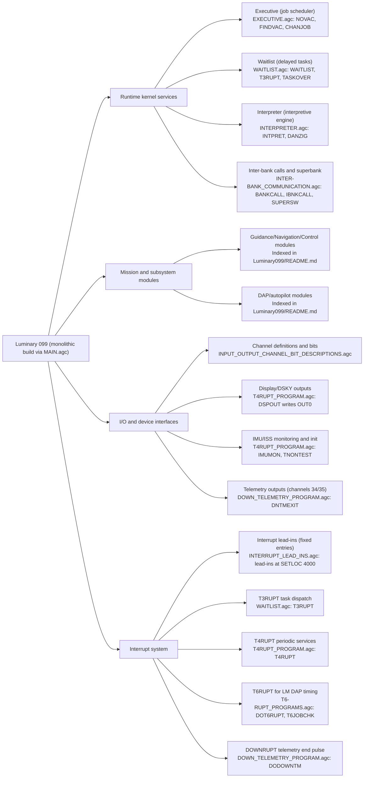
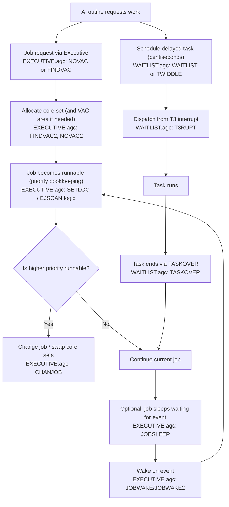
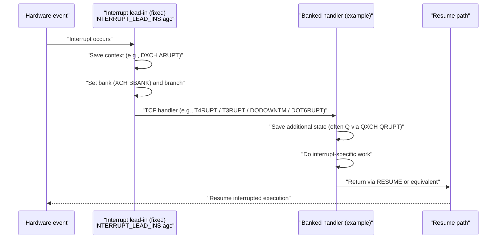
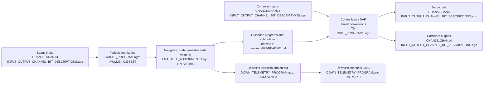
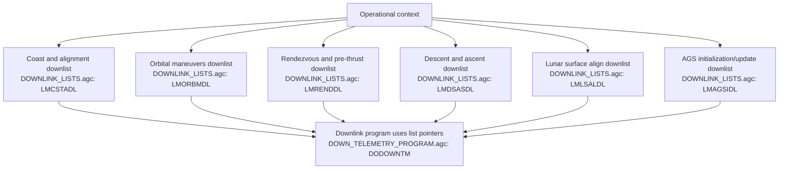

# Diagrams (Mermaid)

Back to: [Luminary 099 Documentation Wiki](index.md)

This page collects Mermaid diagrams for Luminary 099. The diagrams are grounded in the repository’s source modules, especially:

1. Executive and Waitlist scheduling (`Luminary099/EXECUTIVE.agc`, `Luminary099/WAITLIST.agc`).
2. Interrupt lead-ins and interrupt programs (`Luminary099/INTERRUPT_LEAD_INS.agc`, `Luminary099/T4RUPT_PROGRAM.agc`, `Luminary099/T6-RUPT_PROGRAMS.agc`, `Luminary099/DOWN_TELEMETRY_PROGRAM.agc`).
3. Interpreter execution (`Luminary099/INTERPRETER.agc`).
4. I/O and channel semantics (`Luminary099/INPUT_OUTPUT_CHANNEL_BIT_DESCRIPTIONS.agc`, `Luminary099/ERASABLE_ASSIGNMENTS.agc`).
5. Downlink list categories (`Luminary099/DOWNLINK_LISTS.agc`).

## A. System architecture diagram

## B. Task scheduling / Executive flow

This diagram focuses on the job/task scheduling services that are explicit in the source.

## C. Interrupt handling sequence

This is a generic sequence grounded in how lead-ins save `ARUPT` and vector into handlers (e.g., `INTERRUPT_LEAD_INS.agc` lead-ins) and how several handlers save `QRUPT` and return to resume (`WAITLIST.agc`, `T6-RUPT_PROGRAMS.agc`, `DOWN_TELEMETRY_PROGRAM.agc`).

## D. Data flow (sensor inputs → navigation → guidance → control outputs)

This diagram is intentionally high level. Its grounding is in channel semantics (input channels 30–33, controller channels 31/32, output channels 5/6/12/13/14, downlink channels 34/35) and in the presence of navigation/guidance/control module groupings in the Luminary index.

## E. Key mission-mode flow (grounded by downlink list categories)

This flow is grounded in the existence and naming of downlink lists in `Luminary099/DOWNLINK_LISTS.agc`. It does not claim the exact mission program sequencing; it provides a source-grounded “phase vocabulary” that Luminary supports for telemetry contexts.

## See also

1. [Architecture](architecture.md) for textual decomposition matching Diagram A.
2. [Execution model](execution-model.md) for Executive/Waitlist details matching Diagram B.
3. [Interrupts and I/O](interrupts-io.md) for interrupt lead-ins and channel usage matching Diagram C/D.
4. [Telemetry and downlink](telemetry-downlink.md) for list formats and handlers matching Diagram E.
